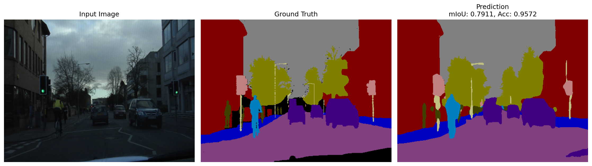
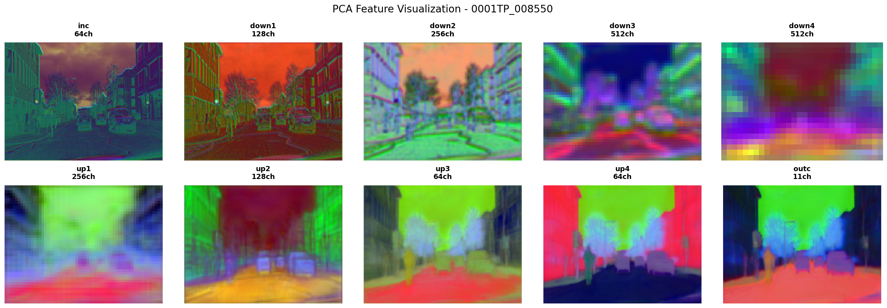

# Upsampler-exp-with-Unet-on-Camvid

本项目基于U-Net实现多种上采样方法的语义分割实验，支持CamVid数据集，包含训练、评估、可视化等完整流程。

---

## 目录
- [Upsampler-exp-with-Unet-on-Camvid](#upsampler-exp-with-unet-on-camvid)
  - [目录](#目录)
  - [项目简介](#项目简介)
  - [依赖环境](#依赖环境)
  - [数据集说明](#数据集说明)
  - [训练方法](#训练方法)
  - [测试与评估](#测试与评估)
    - [主要评估指标](#主要评估指标)
  - [上采样与下采样方法](#上采样与下采样方法)
    - [上采样方法](#上采样方法)
    - [下采样方法](#下采样方法)
  - [日志与可视化](#日志与可视化)
  - [可视化实例](#可视化实例)
    - [语义分割结果](#语义分割结果)
    - [特征PCA可视化](#特征pca可视化)

---

## 项目简介
本项目实现了U-Net结构的多种上采样方法对CamVid数据集的分割实验，支持多种可视化与详细评估。

## 依赖环境
请先安装requirements.txt中的依赖：
```bash
pip install -r requirements.txt
```

## 数据集说明
CamVid数据集包含11个语义类别：
- Sky (天空)
- Building (建筑)
- Pole (杆子)
- Road (道路)
- Sidewalk (人行道)
- Tree (树木)
- SignSymbol (标志符号)
- Fence (围栏)
- Car (汽车)
- Pedestrian (行人)
- Bicyclist (骑自行车的人)

数据目录结构：
- 训练图像：`CamVid/train/`
- 训练标签：`CamVid/train_labels/`
- 验证图像：`CamVid/val/`
- 验证标签：`CamVid/val_labels/`
- 测试图像：`CamVid/test/`
- 测试标签：`CamVid/test_labels/`

## 训练方法
1. 修改 `UNet/train.py` 中数据集路径（取消第25行注释，注释第26行）。
2. 运行训练：
```bash
python UNet/train.py --epochs 100 --batch-size 8 --learning-rate 3e-5
```
训练过程中会自动进行evaluate，可用TensorBoard实时查看训练日志。

## 测试与评估
测试脚本支持自动选择最佳模型、详细指标统计和可视化：
```bash
python UNet/test.py \
    --batch-size 4 \
    --n-models 10 \
    --scale 1.0 \
    --amp \
    --normalize \
    --save-results ./test_results/ \
    --checkpoint-dir ./checkpoints/
```
输出包括：总体/每类指标、混淆矩阵、最佳模型信息等csv文件。

### 主要评估指标
- Mean Dice Score
- Overall Pixel Accuracy
- Mean IoU (mIoU)
- Frequency Weighted IoU
- Per-class Pixel Accuracy
- Per-class IoU

## 上采样与下采样方法

### 上采样方法
- `bilinear`：双线性插值（默认，平滑，通用）
- `nearest`：最近邻插值（边缘清晰）
- `maxunpooling`：最大值反池化（需配合max-pooling-indices）
- `deconvolution`：转置卷积（可学习）
- `carafe`：内容感知上采样（高质量）
- `DySample系列`：动态采样（多种配置，支持自适应采样点）
### 下采样方法
- `max-pooling`（默认）
- `max-pooling-indices`（配合maxunpooling）
- `avg-pooling`
>所有算子已经提供实现，可以直接更改传入参数进行训练


## 日志与可视化
本项目使用TensorBoard，记录训练/验证损失、IoU、精度、每类指标、图像可视化、权重分布等。

启动TensorBoard：
```bash
tensorboard --logdir=./logs/tensorboard --port=6006
```


## 可视化实例

下图为分割结果与特征可视化示例：

### 语义分割结果



- 左：输入图像
- 中：真实标签
- 右：模型预测（mIoU/Acc见图中）

### 特征PCA可视化



- 展示了U-Net各层特征经过PCA降维后的可视化效果

---

如需详细配置和进阶用法，请阅读源代码，已经有相对详细的注释
